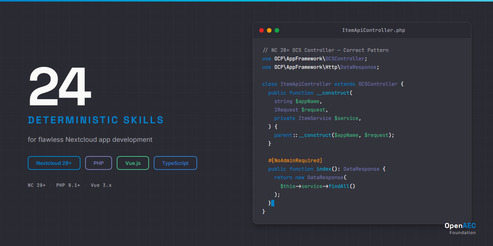

# 24 Deterministic Claude AI Skills for Nextcloud

<p align="center">
  
</p>


A comprehensive skill package enabling Claude AI to generate **production-ready Nextcloud code** for PHP backend, TypeScript/Vue.js frontend, OCS API, WebDAV, and app framework development. Built on the [Agent Skills](https://agentskills.org) open standard.

---

## The Problem

Without domain-specific skills, Claude generates outdated or incorrect Nextcloud patterns — missing security attributes, using deprecated APIs, producing code that compiles but fails at runtime.

```php
// Without skills — missing security attributes, no DI, deprecated pattern
class MyController extends Controller {
    public function index() {
        return new JSONResponse(['data' => 'hello']);
    }
}
```

```php
// With skills — correct NC 28+ patterns: OCSController, DI, security attributes
use OCA\MyApp\Service\MyService;
use OCP\AppFramework\Http\Attribute\NoAdminRequired;
use OCP\AppFramework\Http\DataResponse;
use OCP\AppFramework\OCSController;
use OCP\IRequest;

class MyController extends OCSController {
    public function __construct(
        string $appName,
        IRequest $request,
        private MyService $service,
    ) {
        parent::__construct($appName, $request);
    }

    #[NoAdminRequired]
    public function index(): DataResponse {
        return new DataResponse($this->service->findAll());
    }
}
```

## Skill Organization

The 24 skills are organized across five categories. See **[INDEX.md](INDEX.md)** for the complete catalog with links.

### Core (3 skills)

| Skill | Focus |
|-------|-------|
| `nextcloud-core-architecture` | Platform architecture, IBootstrap lifecycle, DI container, service layer |
| `nextcloud-core-config` | config.php, IConfig/IAppConfig, occ config commands, environment variables |
| `nextcloud-core-security` | Security model, middleware chain, CSP, rate limiting, encryption |

### Syntax (8 skills)

| Skill | Focus |
|-------|-------|
| `nextcloud-syntax-ocs-api` | OCS REST API, v1 vs v2, response envelope, share API, capabilities |
| `nextcloud-syntax-webdav` | DAV operations, PROPFIND/GET/PUT, chunked upload v2, properties |
| `nextcloud-syntax-controllers` | Controller types, routes.php, attribute routing, security attributes |
| `nextcloud-syntax-database` | Migrations, Entity, QBMapper, query builder, Oracle/Galera constraints |
| `nextcloud-syntax-events` | IEventDispatcher, typed events, built-in event catalog, frontend event-bus |
| `nextcloud-syntax-authentication` | Login Flow v2, app passwords, CSRF, rate limiting, brute force protection |
| `nextcloud-syntax-frontend` | @nextcloud/vue, axios, router, initial-state, dialogs, Webpack, CSS theming |
| `nextcloud-syntax-file-api` | IRootFolder, File/Folder interfaces, file events, getById() patterns |

### Implementation (7 skills)

| Skill | Focus |
|-------|-------|
| `nextcloud-impl-app-scaffold` | Directory structure, info.xml, Application.php, IBootstrap, namespaces |
| `nextcloud-impl-app-development` | Full-stack workflow: Controller → Service → Mapper → Vue.js |
| `nextcloud-impl-background-jobs` | TimedJob, QueuedJob, cron modes, scheduleAfter, parallel run control |
| `nextcloud-impl-occ-commands` | Built-in occ commands, custom Symfony Console commands |
| `nextcloud-impl-collaboration` | Share API CRUD, notifications, activity stream, push notifications |
| `nextcloud-impl-testing` | PHPUnit, unit/integration tests, mocking NC services, Vue Test Utils |
| `nextcloud-impl-file-operations` | File CRUD workflows, search, event-driven processing, trash, versioning |

### Error Diagnosis (4 skills)

| Skill | Focus |
|-------|-------|
| `nextcloud-errors-api` | OCS v1/v2 confusion, missing headers, DAV errors, auth failures, CORS |
| `nextcloud-errors-app` | Namespace/autoloading, info.xml, migrations, bootstrap timing, DI failures |
| `nextcloud-errors-database` | Migration failures, query builder mistakes, Oracle/Galera constraints |
| `nextcloud-errors-frontend` | Vue/Webpack errors, CSRF/CORS, import paths, version mismatches |

### Agents (2 skills)

| Skill | Focus |
|-------|-------|
| `nextcloud-agents-review` | 8-area validation checklist, 34 consolidated anti-patterns |
| `nextcloud-agents-app-scaffolder` | Generates complete Nextcloud app with 20+ file templates |

## Technology Coverage

| Area | What the Skills Cover |
|------|----------------------|
| **OCS API** | REST endpoints, user provisioning, shares, capabilities, notifications, autocomplete |
| **WebDAV** | File operations, PROPFIND, chunked upload v2, properties, namespaces, public share DAV |
| **App Framework** | Controllers, services, entities, mappers, migrations, DI, middleware |
| **Vue.js Frontend** | @nextcloud/vue components, routing, state, initial-state bridge, dark mode |
| **Authentication** | Login Flow v2, app passwords, OAuth2, CSRF tokens, brute force protection |
| **File Handling** | INode API, IRootFolder/IUserFolder, storage backends, file event listeners |
| **Collaboration** | OCS Share API, INotificationManager, IActivityManager, push notifications |
| **Administration** | occ commands, config.php, background jobs, cron modes |
| **Database** | Migrations, Entity/QBMapper, query builder, Oracle/Galera compatibility |
| **Testing** | PHPUnit, integration tests, mocking, Vue Test Utils, Jest |

## How Skills Activate

Skills activate contextually based on what you ask Claude to do:

- **"Create a new Nextcloud app"** → triggers `impl-app-scaffold` + `agents-app-scaffolder`
- **"Add an OCS API endpoint"** → triggers `syntax-controllers` + `syntax-ocs-api`
- **"Upload files via WebDAV"** → triggers `syntax-webdav`
- **"I'm getting a 997 error from OCS"** → triggers `errors-api`
- **"Review my Nextcloud app code"** → triggers `agents-review`
- **"Set up background processing"** → triggers `impl-background-jobs`

## Installation

### Claude Code (CLI)

```bash
# Option 1: Clone and copy
git clone https://github.com/OpenAEC-Foundation/Nextcloud-Claude-Skill-Package.git
cp -r Nextcloud-Claude-Skill-Package/skills/source/ ~/.claude/skills/nextcloud/

# Option 2: Git submodule (recommended for projects)
git submodule add https://github.com/OpenAEC-Foundation/Nextcloud-Claude-Skill-Package.git .claude/skills/nextcloud
```

### Claude.ai (Web / Desktop)

1. Go to your Claude.ai Project
2. Open the **Knowledge** section
3. Upload individual `SKILL.md` files for the skills you need
4. Each skill's `references/` files can be uploaded alongside for deeper coverage

### Skill Structure

Each skill follows the same structure:

```
skill-name/
├── SKILL.md              # Main file (<500 lines) — quick reference, patterns, decision trees
└── references/
    ├── methods.md        # Complete API signatures and method tables
    ├── examples.md       # Working code examples (PHP + Vue.js)
    └── anti-patterns.md  # What NOT to do, with explanations
```

## Version Compatibility

| Technology | Version | Notes |
|------------|---------|-------|
| Nextcloud Server | **28+** | Primary target — all skills verified against NC 28+ |
| PHP | 8.1+ | Minimum PHP version for NC 28 |
| Vue.js | 3.x | NC 28+ uses Vue 3 (breaking change from NC 27) |
| TypeScript | 5.x | Frontend type safety |
| Node.js | 18+ | Build tooling |
| @nextcloud/vue | v8+ | NC 28+ component library |

## Quality Guarantees

Every skill in this package meets these standards:

- **Deterministic** — Uses ALWAYS/NEVER language, not "you might consider"
- **Version-correct** — All code verified against Nextcloud 28+ APIs
- **Multi-language** — App development skills show both PHP backend and Vue.js frontend
- **Anti-pattern-aware** — Known mistakes explicitly documented and prevented
- **Size-constrained** — Every SKILL.md is under 500 lines; heavy content goes in `references/`
- **Self-contained** — Each skill works independently without requiring other skills

## Methodology

Built using the **7-phase research-first methodology**, proven across multiple skill packages:

1. **Raw Masterplan** — Scope definition and preliminary skill inventory
2. **Deep Research** — 19-section analysis of all Nextcloud API surfaces
3. **Masterplan Refinement** — Skill merges/additions based on research (25 → 24 skills)
4. **Topic Research** — Per-skill deep-dives (integrated into phase 2)
5. **Skill Creation** — 8 batches of 3 parallel agents, quality gate per batch
6. **Validation** — Structural + content validation across all 24 skills
7. **Publication** — INDEX.md, README.md, GitHub release

## Documentation

| Document | Purpose |
|----------|---------|
| **[INDEX.md](INDEX.md)** | Complete skill catalog with descriptions and links |
| [ROADMAP.md](ROADMAP.md) | Project status and progress tracking |
| [REQUIREMENTS.md](REQUIREMENTS.md) | Quality guarantees and per-area requirements |
| [DECISIONS.md](DECISIONS.md) | Architectural decisions with rationale (D-001+) |
| [SOURCES.md](SOURCES.md) | Official reference URLs and verification rules |
| [WAY_OF_WORK.md](WAY_OF_WORK.md) | 7-phase development methodology |
| [LESSONS.md](LESSONS.md) | Lessons learned during development |
| [CHANGELOG.md](CHANGELOG.md) | Version history |

## Related Projects

| Project | Skills | Domain |
|---------|--------|--------|
| [ERPNext Skill Package](https://github.com/OpenAEC-Foundation/ERPNext_Anthropic_Claude_Development_Skill_Package) | 28 | ERPNext/Frappe development |
| [Blender-Bonsai Skill Package](https://github.com/OpenAEC-Foundation/Blender-Bonsai-ifcOpenshell-Sverchok-Claude-Skill-Package) | 73 | Blender, Bonsai, IfcOpenShell & Sverchok |
| [Tauri 2 Skill Package](https://github.com/OpenAEC-Foundation/Tauri-2-Claude-Skill-Package) | 27 | Tauri 2 desktop apps (Rust + TypeScript) |

## Contributing

Contributions are welcome. If you find incorrect patterns or want to add coverage for new Nextcloud APIs:

1. Check [SOURCES.md](SOURCES.md) for approved documentation URLs
2. Follow the skill structure defined in [WAY_OF_WORK.md](WAY_OF_WORK.md)
3. Ensure SKILL.md stays under 500 lines with deterministic ALWAYS/NEVER language
4. Submit a pull request with a description of what was changed and why

## License

[MIT](LICENSE) — Part of the [OpenAEC Foundation](https://github.com/OpenAEC-Foundation) ecosystem.
